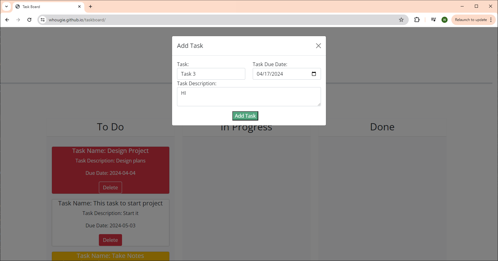
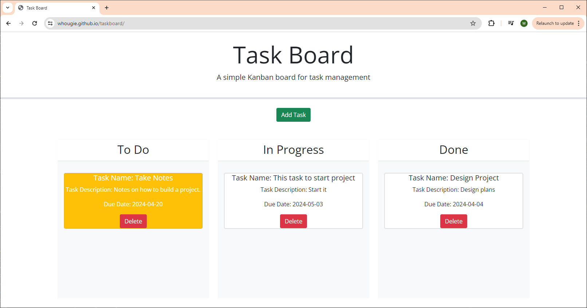

# Taskboard - Kanban 

# Links
- Deployment URL: https://whougie.github.io/taskboard/
- GitHub URL: https://github.com/whougie/taskboard.git

# Description
This project allows the user to create tasks (Task Name, Task Description, and Due Date) and add them to the taskboard.  The board will display the task in certain colors depending on if the due date has past (red background for task), the due date is today (yellow background for task), and the due date is still in the future (white background for task).  The user can move the tasks into the "To Do", "In Progress", or "Done" column.  Once the task has been moved to the "Done" column the task will have a background color of white.  When you no longer need the tasks, the task can be deleted by pressing the "Delete" button.

Form creation for task:

Moving tasks around on the taskboard:
